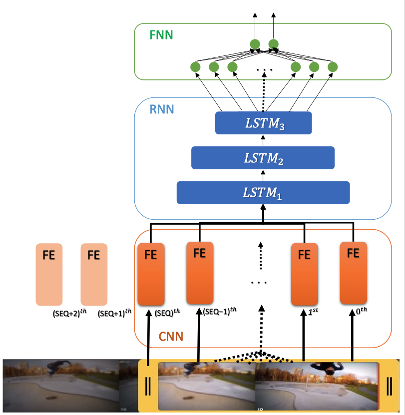

# COLANET Training Models



### Requirements:

Run a tensforflow docker with gpu, python3 and jupyter-notebook:

```
CWD=$(pwd)
docker run -it --gpus all --rm -v /tmp:/tmp -v $CWD:/tf/notebooks -p 8888:8888 -p 6006:6006 tensorflow/tensorflow:nightly-gpu-py3-jupyter
```

Afterwards you should be able to access to the jupyter-notebooks provided in your browser at [http://127.0.0.1:8888/](http://127.0.0.1:8888/)

### Additional Information

The most important files are explained bellow:

[installer.ipynb](installer.ipynb) - Simplifies the process of install new python libs on the docker

[FileCopy.ipynb](FileCopy.ipynb) - Jupyter notebook to simplify preparing the datasets for Feature Extractors. 
The Feature Extractors require files in directories on directories:
  - ./data/images/train/collision 
  - ./data/images/train/no_collision 
  - ./data/images/test/collision 
  - ./data/images/test/no_collision

[VGG.ipynb](VGG.ipynb) - Jupyter notebook to Train VGG Feature Extrator

[MobileNetV2.ipynb](MobileNetV2.ipynb) - Jupyter notebook to Train MobileNetV2 Feature Extrator

[MobileNetV2_Feature_Extraction.ipynb](MobileNetV2_Feature_Extraction.ipynb) - Uses a model (for example the MobileNetV2 model) and generate a csv with the features for all images

[RNN Training.ipynb](RNN_Training.ipynb) - Used to Train the RNN+FNN model
  
[FullModel.ipynb](FullModel.ipynb) - Uses the Features previously processed to train the FE+RNN+FNN model


